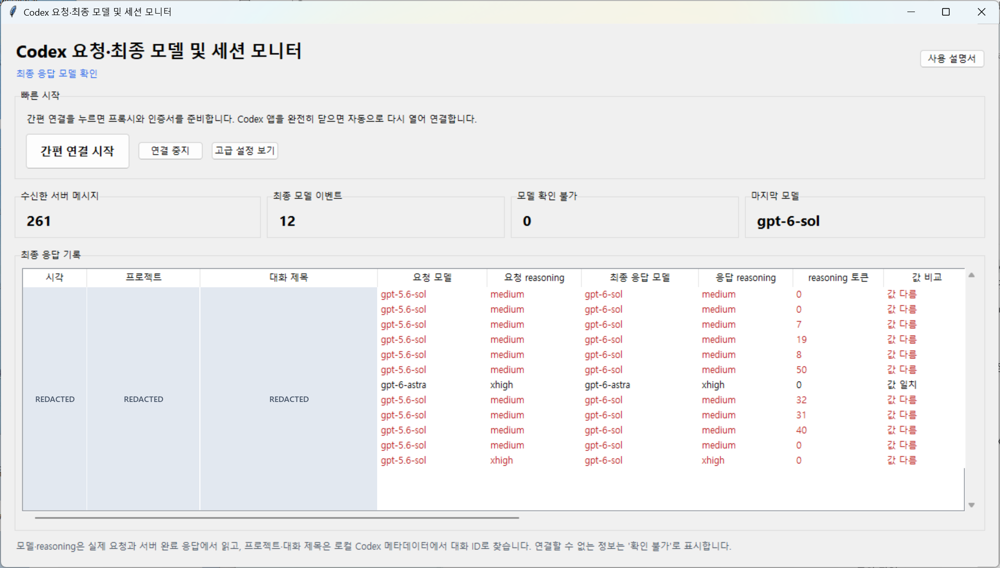
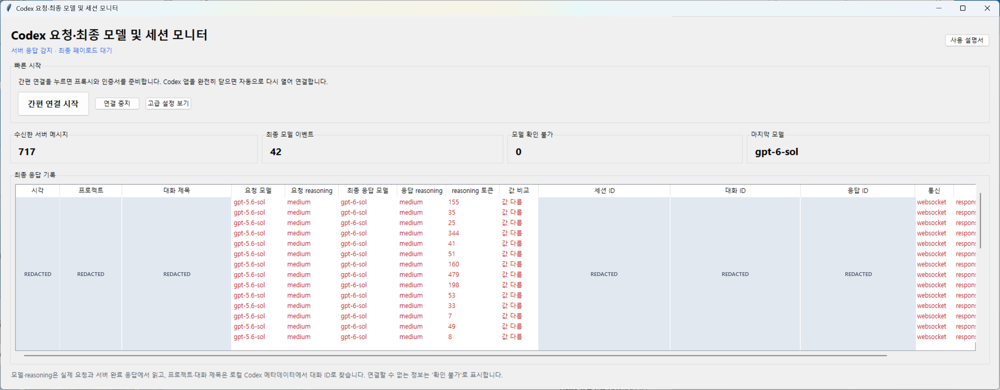

# Codex Model Probe

**Codex가 요청한 모델과 서버가 완료 응답에 보고한 모델을 실시간으로 비교하는 Windows GUI입니다.**

Compare the **requested model** with the **model reported in Codex's completed server response**, live in a Windows GUI.

실제 요청·응답에서 모델명, reasoning effort, reasoning 토큰 수를 읽고, 로컬 Codex 기록을 연결해 어느 프로젝트·대화의 응답인지 보여줍니다. 연결해 둔 동안 계속 기록합니다.

Read model names, reasoning effort, and reasoning token usage from actual network messages, with project and conversation labels matched from local Codex metadata. Monitoring continues while connected.

**Windows 10/11 · 한국어 / English GUI · 설치 파일 하나 / One installer**

| 언어 / Language | 다운로드 / Download | 설치·인증서·사용법 / Full guide |
| --- | --- | --- |
| 한국어 | [한글판 설치 EXE](https://github.com/jinyounghub/codex-model-probe/releases/latest/download/CodexModelProbe-Setup-ko.exe) | [한글 사용 설명서](README.ko.md) |
| English | [English installer EXE](https://github.com/jinyounghub/codex-model-probe/releases/latest/download/CodexModelProbe-Setup-en.exe) | [English user guide](README.en.md) |

[모든 배포 파일·ZIP·SHA-256 / All downloads and checksums](https://github.com/jinyounghub/codex-model-probe/releases/latest)

## 실제 구동 화면 / Live preview

실제 사용 중 캡처한 **한글판** 화면입니다. 시각·프로젝트·대화 제목과 ID는 공개용 이미지에서 불투명하게 가렸으며, 모델명·reasoning·토큰 수는 원본 그대로입니다. 영문판도 같은 기능을 제공합니다.

Actual capture of the **Korean GUI**. Timestamps, project/conversation labels, and IDs are covered in the published images; model names, reasoning, and token counts are unchanged. The English GUI has the same features.

## 한눈에 보기 / At a glance

| 기능 / Feature | 확인할 수 있는 정보 / What you can see |
| --- | --- |
| **요청 ↔ 응답 모델 / Model comparison** | 실제 요청의 `model`과 서버 완료 응답의 `model`을 나란히 표시하고 값이 다르면 강조합니다. Compare model strings from the outgoing request and completed server response; differences are highlighted. |
| **Reasoning** | 요청·응답의 `reasoning.effort`와 서버가 보고한 reasoning 토큰 수를 표시합니다. See requested and reported effort, plus reported reasoning token usage. |
| **어느 대화인지 / Conversation context** | 로컬 메타데이터로 프로젝트·대화 제목을 찾고 세션·대화·응답 ID를 함께 표시합니다. Match local project/conversation labels and inspect session, thread, and response IDs. |
| **지속 모니터링 / Continuous monitoring** | 수신 메시지·완료 이벤트·마지막 모델을 갱신하고 새 완료 응답을 표에 추가합니다. Watch live counters and completed responses; the table shows the latest 500 rows. |
| **기록 저장 / Local history** | 메타데이터를 로컬 `results.jsonl`에 누적해 기존 기록도 다시 볼 수 있습니다. Append metadata to a local `results.jsonl` file and reopen existing records. |

### 화면의 값을 읽는 방법 / Reading the example

이 캡처에는 요청 모델 `gpt-5.6-sol` → 응답 모델 `gpt-6-sol`로 **문자열이 다른 행**과, `gpt-6-astra` → `gpt-6-astra`로 **같은 행**이 함께 있습니다. `medium`, `xhigh`는 effort 값이며, reasoning 토큰은 서버의 사용량 보고값입니다.

This capture includes differing strings (`gpt-5.6-sol` → `gpt-6-sol`) and matching strings (`gpt-6-astra` → `gpt-6-astra`). Values such as `medium` and `xhigh` are effort settings; reasoning token counts come from server usage reports.

> **해석 범위 / Interpretation:** `최종 응답 모델`은 `response.completed.response.model` 등 **서버가 보고한 필드**입니다. 실제 모델 가중치나 내부 라우팅을 독립적으로 증명하지 않습니다. 필드가 없거나 연결을 확인할 수 없으면 `확인 불가`로 표시합니다. The final model is a **server-reported field**, not independent proof of model weights or internal routing. Missing fields or uncertain associations are shown as `Unknown`.

세션·대화·응답 ID 열까지 펼친 화면 / Expanded view with identifier columns

가로 스크롤로 ID·통신 방식·최종 페이로드 근거 필드를 볼 수 있습니다. 회색 `REDACTED` 영역은 게시용 이미지에만 적용한 가림 처리입니다.

Scroll horizontally to inspect IDs, transport, and the payload evidence field. The gray `REDACTED` blocks were added only to these published screenshots.

## 빠른 시작 / Quick start

Python 설치나 PowerShell 설치 스크립트 실행 없이 시작할 수 있습니다. Windows Codex 데스크톱 앱이 필요하며, 자동 재실행은 Microsoft Store/Appx 설치를 지원합니다.

No separate Python installation or PowerShell setup script is needed. Requires the Windows Codex desktop app; automatic reopening supports Microsoft Store/Appx installations.

| 단계 / Step | 한국어 | English |
| --- | --- | --- |
| 1 | 위에서 원하는 언어의 설치 EXE를 받아 설치합니다. | Download and run the installer for your language. |
| 2 | 바탕화면의 **Codex Model Probe**를 열고 **간편 연결 시작**을 누릅니다. | Open **Codex Model Probe** and click **Quick connect**. |
| 3 | 최초 1회, 이 PC에서 생성한 인증서의 지문·신뢰 범위를 확인하고 동의하면 설치합니다. | On first use, review the locally generated certificate's fingerprint and trust scope, then confirm if you agree. |
| 4 | Codex를 **완전히 종료**합니다. 모니터가 다시 열면 메시지를 보내고 새 행을 확인합니다. | **Fully close Codex**. After the monitor reopens it, send a message and watch for a new row. |

종료할 때는 **프록시로 열린 Codex 종료 → 연결 중지 → Codex 평소대로 실행** 순서로 진행하세요. 자세한 인증서 설명·문제 해결·제거 방법은 [한글 설명서](README.ko.md)와 [English guide](README.en.md)에 있습니다.

To finish: **close the proxied Codex app → Stop connection → reopen Codex normally**. See the guides above for certificate details, troubleshooting, and removal.

## 데이터와 연결 방식 / Data and connection

- **모델·reasoning 출처 / Model and reasoning source:** 실제 요청과 서버 완료 페이로드에서 읽습니다. 프로젝트·대화 제목은 로컬 Codex 메타데이터에서 읽기 전용으로 연결합니다. Read from actual requests and completed responses. Project/conversation labels are joined from local Codex metadata, read-only.
- **로컬 기록 / Local records:** 기본 저장 위치는 `%LOCALAPPDATA%\CodexModelProbe\results.jsonl`입니다. 원본 프롬프트·응답 본문·인증 헤더는 저장하지 않습니다. ID는 포함되므로 공유 전 가려야 합니다. Records default to `%LOCALAPPDATA%\CodexModelProbe\results.jsonl`. Raw prompts, response bodies, and authorization headers are not saved. Records contain IDs, so redact them before sharing.
- **연결 / Connection:** 내장 프록시는 `127.0.0.1`에서 실행되고 `chatgpt.com`, `api.openai.com`의 HTTPS를 분석합니다. 새로 여는 Codex 프로세스에 프록시를 적용합니다. The embedded proxy listens on `127.0.0.1` and inspects HTTPS for `chatgpt.com` and `api.openai.com`. Proxy settings apply to the Codex process it launches.
- **설치 / Installation:** 현재 사용자 폴더에 설치하며 바로가기와 제거 프로그램을 제공합니다. 인증서 신뢰는 앱에서 확인한 뒤 적용합니다. Installs for the current user with shortcuts and an uninstaller. Certificate trust is applied after confirmation in the app.

**v0.4.0 배포 안내 / Distribution:** 일반 HTTP 프록시가 내장되어 있습니다. 프로세스 캡처·WinDivert·이전 독립형 `mitmdump.exe`는 포함하지 않습니다. 설치 파일은 코드 서명이 없으며 [배포 파일 해시](https://github.com/jinyounghub/codex-model-probe/releases/latest)와 [기존 Defender 탐지 및 변경 내역](DEFENDER.md)을 제공합니다.

The v0.4.0 installers bundle the explicit HTTP proxy. Process capture, WinDivert, and the old standalone `mitmdump.exe` are excluded. Builds are unsigned; see the release checksums and [Defender history](DEFENDER.md). Acceptance by every security product is not guaranteed. Portable ZIPs are also available; extract the entire archive and keep `_internal` beside the EXE.
